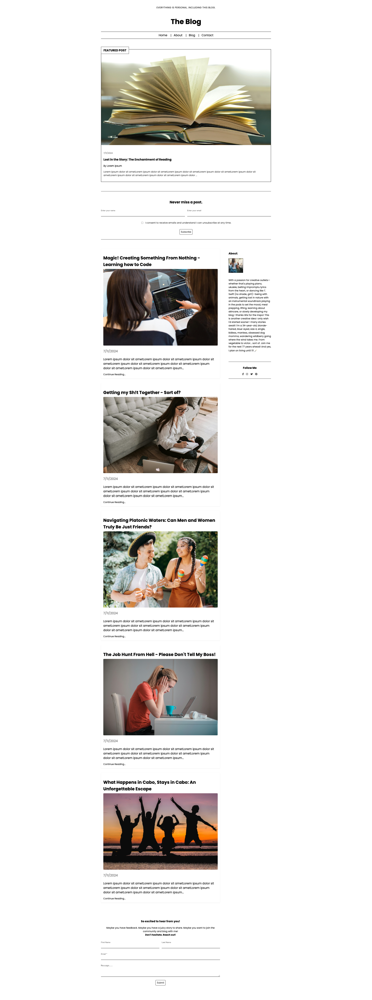

# The Blog

The Blog is a digital trash can that homes a myriad of expressions; thoughts, experiences, perspectives, contemplations, questions, etc... It's a blog - for now.

## Image of app (Homepage)

## Repo:

https://github.com/fswDevSteph/theblog

## To Run Project:

- Clone the project
- CD into the project
- CD into the backend folder and run 'npm i' to install all backend dependencies
- Start the server: 'node --watch server.js'
- CD into the client folder and run 'npm i' to install all frontend dependencies
- Display project in browser: run 'npm run dev' and click the link that populates in your terminal to open the project in browser

## Upcoming Iterations

### Iteration 1

- Optimize images, image storage and retrieval.

### Iteration 2

- User Comments
- AI Bot Comment Monitoring

### Iteration

- Admin Dashboard
- Profiles
- Login / Logout
- Authentication

## Contributors

N/A

## Known Issues:

- Slower than desired load times

## About Developer:

Stephanie Perroni is a full stack software development student with 5+ years of experience as a software tester on various projects who hopes to make meaningful and positively impactful contributions in the software development space - despite not exactly being the likely candidate.
